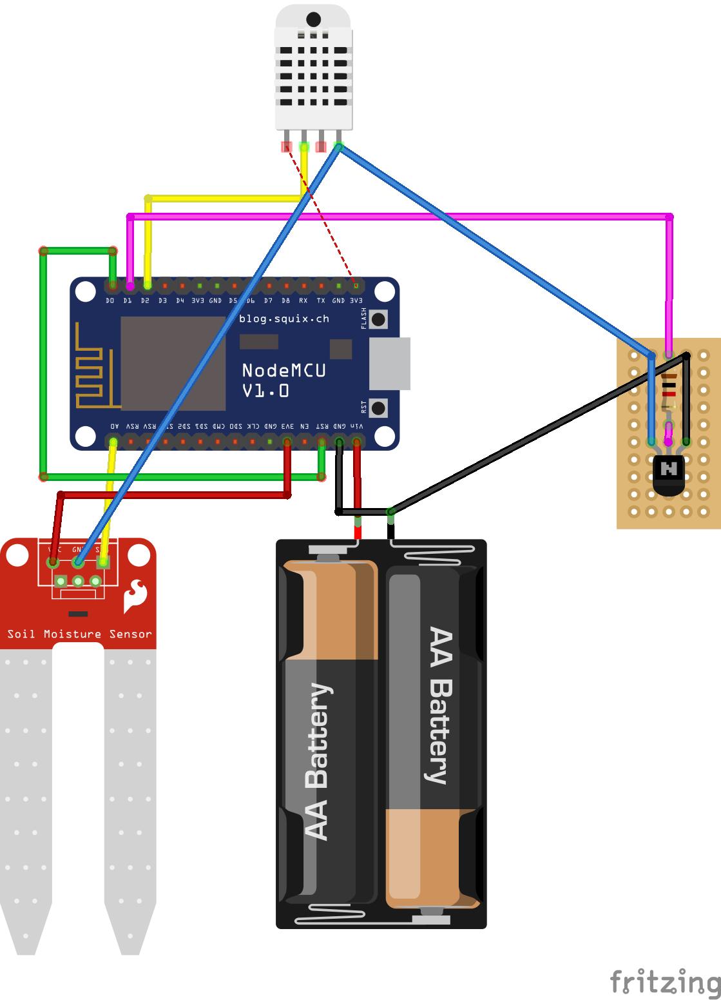

# plant buddy

> nodeMCU based moisture monitoring for plants 🌱 with a serverless backend

## Hardware

The hardware setup consists of a [ESP8266](https://en.wikipedia.org/wiki/ESP8266) Microcontroller with a powersupply and two connected sensors.

- [DHT22](https://www.adafruit.com/product/385) connected to **D2** digital input pin
- [Soil moisture sensor](https://www.sparkfun.com/products/13322) connected to **A0**
- Bridge between **D0** and **RST** to enable deep sleep for optimizing battery life
- switch off sensors during deepsleep using a transistor driven via pin **D1**

> To program the ESP8266 you need to clear the connection to **RST**

[](sketch.png)

### Power consumption

- ESP8266 draws `~80mA` when active and few `µA` when in deepsleep
- Maximum output current per GPIO pin is `12mA`
- Photo resistor has `10kOhm` resistor -> `3V3 / 10kOhm = 33mA`
- Moisture sensor consumes `35mA`
- DHT222 max current `2.5mA`

## Setup

### Serverless backend

The backend is hosted on Microsoft Azure and can be deployed using [Terraform](https://www.terraform.io/). In the [terraform/](terraform/) folder is the recipe to deploy the required components. To run this command the Azure CLI needs to be installed and a valid Azure subscription has to exist.

```sh
cd terraform
terraform apply -var owm_key=<YOUR KEY>
```

As an output you will get a `git_url` this is where you need to deploy the backend code to.

### Backend code

```text
firebase functions:config:set owm.key=<OpenWeatherMap API Token>
firebase functions:config:set owm.city_id=2873776 // according to [OWM City ID List](https://openweathermap.org/current#cityid)
firebase functions:config:set header.secret=<some secret>
```

#### Local development

For devleoping the function locally:

```sh
# get a copy of the environment config
firebase functions:config:get > functions/.runtimeconfig.json
# start function host locally
firebase serve --only functions
```
## Useful links

- https://openhomeautomation.net/esp8266-battery
- http://www.instructables.com/id/Interface-Moisture-Sensor-With-NodeMCU/
- https://www.losant.com/blog/getting-started-with-the-esp8266-and-dht22-sensor
- https://www.losant.com/blog/making-the-esp8266-low-powered-with-deep-sleep