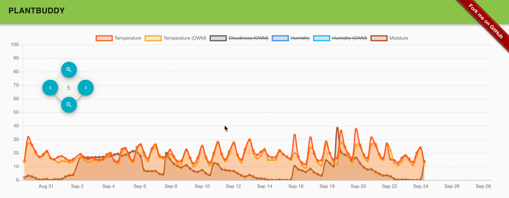
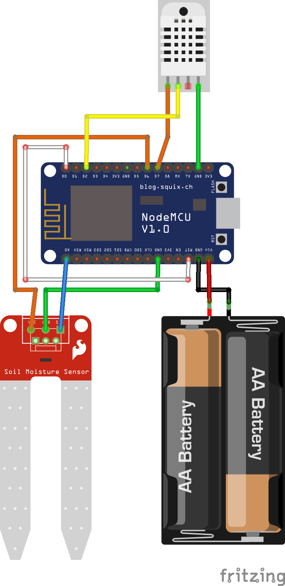

<p align="center"></p>

[](https://greenkeeper.io/)
[](https://travis-ci.org/anoff/plantbuddy)

> nodeMCU based moisture monitoring for plants 🌱 with a serverless backend

## Main Features

1. Collect sensor readings every 15 minutes
1. Deep sleep to preserve battery
1. Submit values to serverless infrastructure using local WiFi network
1. Automatically fetch weather report for each reading using backend function
1. View sensor data on web page
1. Movable navigation panel
1. Mobile friendly page

### Webpage demo



### System Overview


## Hardware

The hardware setup consists of a [ESP8266](https://en.wikipedia.org/wiki/ESP8266) Microcontroller with a powersupply and two connected sensors.

- [DHT22](https://www.adafruit.com/product/385) connected to **D2** digital input pin
- [Soil moisture sensor](https://www.sparkfun.com/products/13322) connected to **A0**
- Bridge between **D0** and **RST** to enable deep sleep for optimizing battery life

> To program the ESP8266 you need to clear the connection to **RST**

[](assets/sketch.png)

### Power consumption

- ESP8266 draws `~80mA` when active and few `µA` when in deepsleep
- Maximum output current per GPIO pin is `12mA`
- Photo resistor has `10kOhm` resistor -> `3V3 / 10kOhm = 33mA`
- Moisture sensor consumes `35mA`
- DHT222 max current `2.5mA`

## Microcontroller

The ESP8266 chip is programmed with the [esp8266.ino file](esp8266.ino) using the [Arduino IDE](https://www.arduino.cc/en/Main/Software?). Secrets for connecting to local WiFi and endpoints to post data need to be defined in a `esp8266.secrets.c` file which is specified at [esp8266.secrets.template.c](esp8266.secrets.template.c).


## Setup

### Serverless backend

As a backend solution the plantbuddy runs on [Google's firebase 🔥](https://console.firebase.google.com) platform. The main functionalities used from firebase are:

1. Firestore database to store all sensor readings and heartbeats
1. Firebase functions for providing an **HTTP endpoint** as well as querying for **weather data** for each sensor reading

> Note: As outbound traffic is required to collect weather data, the project should run in **BLAZE** plan. Function and database usage should be within the free tier, only outbound traffic will be billed.

### Backend code

Before deploying the backend code several variables need to be set so the service can work correctly. An API token for [OpenWeatherMap](https://openweathermap.org/price) can be obtained from their website. A free account should suffice unless a _LOT_ of plantbuddies are running on one account.

```text
firebase functions:config:set owm.key=<OpenWeatherMap API Token>
firebase functions:config:set owm.city_id=2873776 // according to [OWM City ID List](https://openweathermap.org/current#cityid)
firebase functions:config:set header.secret=<some secret>
```

#### Local development

For developing the function locally:

```sh
# get a copy of the environment config
firebase functions:config:get > functions/.runtimeconfig.json
# start function host locally
firebase serve --only functions
```

## Deployment

All the Firebase stuff gets automatically deployed via Travis CI. To set it up create a encrypted token and update the [Travis CI Config](.travis.yml).

```sh
# create a firebase CI token
firebase login:ci

# encrypt the token to your project
docker run --rm caktux/travis-cli encrypt "<token from firebase login:ci>" -r anoff/plantbuddy
```

## Useful links

- https://openhomeautomation.net/esp8266-battery
- http://www.instructables.com/id/Interface-Moisture-Sensor-With-NodeMCU/
- https://www.losant.com/blog/getting-started-with-the-esp8266-and-dht22-sensor
- https://www.losant.com/blog/making-the-esp8266-low-powered-with-deep-sleep

## License

- The logo designed by [@reallinfo](https://github.com/reallinfo)
- The logo is licensed under a [Creative Commons Attribution 4.0 International License](https://creativecommons.org/licenses/by/4.0/)
- All sourcecode is licensed under [MIT](./LICENSE) unless stated otherwise
